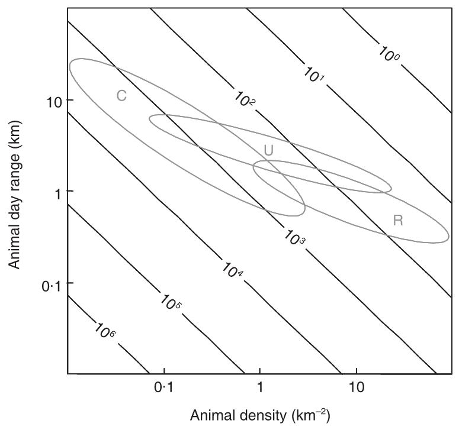
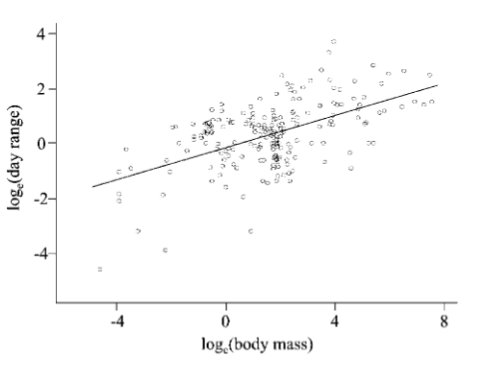

---
jupytext:
  formats: md:myst
  text_representation:
    extension: .md
    format_name: myst
kernelspec:
  display_name: Python 3
  language: python
  name: python3
editor_options:
  markdown:
    wrap: none
---
(i_sp_type)=
# {{ title_i_sp_type }}
::::::::{hint}
**{{ term_sp_type_carnivore }}**: {{ def_sp_type_carnivore }}
**{{ term_sp_type_ungulate }}**: {{ def_sp_type_ungulate }}
**{{ term_sp_type_other }}**: {{ def_sp_type_other }}

This tool will still provide recommendations for species in the "Other" category; this question is posed to support adjustments to recommendations specific to these groups of species.
::::::::

::::::::{tab-set}

:::::::{tab-item} Overview
**<font size="4"><span style="color:#2F5496">How this relates to study design</font></span>**

The survey effort required to obtain an adequate sample will depend on both a) the density and b) day range of the Target Species ({{ rowcliffe_et_al_2008 }}). “Typical combinations of these… parameters can be derived from comparative studies” that provide equations for estimating density and day range based on mammal species’ body size ({{ rtxt_rowcliffe_et_al_2008 }}) ({{ rtxt_silva_downing_1994 }}; {{ rtxt_silva_downing_1995 }}; rtxt_fa_purvis_1997 }}; {{ rtxt_carbone_gittleman_2002; {{ rtxt_rowcliffe_et_al_2003 }}; {{ rtxt_carbone_et_al_2005 }}).

Rowcliffe et al. (2008) suggested that three key mammal groups are carnivores, ungulates, and rodents; note that this tool will only focus on adjustments to recommendations for carnivores and ungulates. In the figure below, Rowcliffe et al., (2008) “superimposes these typical combinations of a) density and b) day range for three key mammal groups (carnivores, ungulates and rodents) on the expected trapping effort required to achieve 10 photographs. This indicates that for only the rarest populations of the large ungulates and carnivores would more than 1,000 camera days be required. In most cases, considerably fewer than 1,000 camera days are required, and sometimes fewer than 100 will be adequate.” ({{ rtxt_rowcliffe_et_al_2008 }}).

```{figure} ../03_images/03_image_files/rowcliffe_et_al_2008_fig5_clipped.png
:height: 500px
:align: center
```
> **Rowcliffe et al., (2008) - Fig. 5.** Expected trapping effort (camera days, indicated by contours) required to achieve 10 photographs given varying density and day range, assuming a group size of 1. Typical combinations of day range and density are indicated for carnivores (C), ungulates (U) and rodents (R), calculated using allometric equations for day range and density at carrying capacity (see text) and illustrating densities between 10% and 100% of carrying capacity.
:::::::

:::::::{tab-item} Visual resources
::::::{grid} 3
:gutter: 3
:class-container: wrapper

:::::{grid-item-card} {{ rtxt_rowcliffe_et_al_2008 }}
<br><br>**Rowcliffe et al., (2008) - Fig. 5.** Expected trapping effort (camera days, indicated by contours) required to achieve 10 photographs given varying density and day range, assuming a group size of 1. Typical combinations of day range and density are indicated for carnivores (C), ungulates (U) and rodents (R), calculated using allometric equations for day range and density at carrying capacity (see text) and illustrating densities between 10% and 100% of carrying capacity.
:::::

:::::{grid-item-card} {{ rtxt_carbone_et_al_2005 }}
<br><br>**Carbone et al., 2005 - Fig. 1** The log<sub>e</sub>(day range) against the log<sub>e</sub>(body mass). Each point represents a single species average. The fitted line illustrates the least squares linear regression.
:::::

:::::{grid-item-card} {{ rtxt_figure3_ref_id }}
<br><br>
:::::

::::::

:::::::

:::::::{tab-item} Analytical tools & Resources
| Type | Name | Note | URL | Reference |
|:----------------|:-------------------------------|:----------------------------------------------------------------|:----------------------|:----------------------------------------|
|
|
|
|
|
|
:::::::

:::::::{tab-item} References
{{ rbib_carbone_gittleman_2002 }}
{{ rbib_carbone_et_al_2005 }}
{{ rbib_fa_purvis_1997 }}
{{ rbib_rowcliffe_et_al_2008 }}
{{ rbib_rowcliffe_et_al_2003 }}
{{ rbib_silva_downing_1994 }}
{{ rbib_silva_downing_1995 }}

:::::::

::::::::
