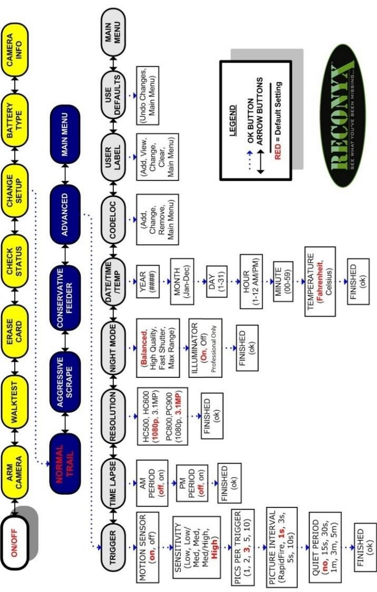
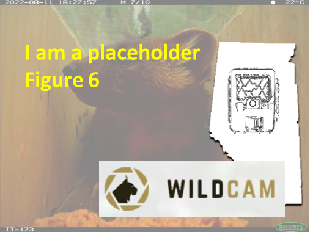

---
jupytext:
  formats: md:myst
  text_representation:
    extension: .md
    format_name: myst
kernelspec:
  display_name: Python 3
  language: python
  name: python3
editor_options:
  markdown:
    wrap: none
---
(i_cam_settings)=
# {{ title_i_cam_settings }}
::::::::{hint}
:::{seealso}
{bdg-link-primary-line}`Camera equipment<https://ab-rcsc.github.io/rc-decision-support-tool_concept-library/02_dialog-boxes/01_39_cam_equipment.html>`
:::

::::::::

::::::::{tab-set}

:::::::{tab-item} Overview
As mentioned in [camera hardware options](/1_survey-guidelines/1_7.0_Camera-deployment.md#TOC_surv_guidelines_camera_hardware_options), it is important to distinguish between camera specifications (features) versus settings (user-defined options). Important settings often include [Trigger Sensitivity](#settings_trigger_sensitivity) (which may affect [detection probability](#detection_probability)), [Motion Image Interval](#settings_motion_image_interval) and [Quiet Period](#settings_quiet_period). The setting option selected may vary according to the [Survey Objectives](#survey_objectives), [modelling approach](#mods_modelling_approach), [Target Species](#target_species), and use (or not) of attractants. Consideration of the camera settings is an important step when designing a [survey](#survey) and in the interpretation of the resulting images.

An example of the settings available in a Reconyx camera is included in [Appendix A - Table A3](/1_survey-guidelines/1_10.1_AppendixA-Tables.md#TOC_surv_guidelines_table_aurv_guidelines_photos-vs-video).

(TOC_surv_guidelines_photos_vs_video)=
### 7.2.1 Photos vs video

Some [Camera Models](#camera_model) allow the user to record video as well as photos. Videos typically use more memory on SD cards, drain camera batteries sooner and are more difficult to process (i.e., extract data) than images. Limiting the length of video taken when the camera is [triggered](#trigger_event) (possible for most [Camera Models](#camera_model)) could help slow how quickly an SD card becomes full. Some [Camera Models](#camera_model) have hybrid settings, which lets you capture photos and videos for each animal detection.

It is generally recommended that cameras are set to capture images rather than videos unless the [objective](#survey_objectives) is related to monitoring animal behaviours, understanding group size and/or determining recruitment (e.g. calves per female), in which case continuous observation may be important. Video is also useful when individual identification is needed, such as for creating “marked” individuals for use in machine learning or computer vision (e.g., Schneider et al., 2019; Vidal et al., 2021).

By default, cameras are set to record images when an animal is detected by the motion and/or infrared detector(s).

(TOC_surv_guidelines_trigger_modes_timelapse_vs_motion_detector)=
### 7.2.2 Trigger Mode(s) - Time-lapse *vs.* motion detector

By default, remote cameras are [triggered](#trigger_event) to take photos when the motion detector detects an animal. Many [Camera Models](#camera_model) allow you to set your camera in both [time-lapse](#timelapse_image) and default motion detector settings.

[Time-lapse images](#timelapse_image) are images taken at regular intervals (e.g., hourly or daily, on the hour), regardless of whether an animal is present or not. It is critical to take a minimum of one [time-lapse image](#timelapse_image) per day at a consistent time (e.g., 12:00 p.m. [noon]) to create a record of camera functionality or local environmental conditions (e.g., snow cover, plant growth, wildfire; Sun et al., 2021)

[Time-lapse images](#timelapse_image) may always be useful for [modelling approaches](#mods_modelling_approach) that require estimation of the “[viewshed](#fov_viewshed)“ (i.e., “[viewshed density estimators](#fov_viewshed_density_estimators),” such as [REM](#mods_rem) or [time-to-event (TTE)](#mods_tte) models; see Moeller et al., [2018] for advantages and disadvantages).

(TOC_surv_guidelines_trigger_sensitivity_photos_per_trigger_motion_image_interval_and_quiet_period)=
### 7.2.3 Trigger Sensitivity, Photos Per Trigger, Motion Image Interval and Quiet Period

The [**Trigger Sensitivity**](#settings_trigger_sensitivity) is camera setting responsible for how sensitive a camera is to activation (to "[triggering](#trigger_event)") via the infrared and/or heat detectors (if applicable, e.g., Reconyx HyperFire cameras have a choice between "Low," "Low/Med," "Med," "Med/High," "High," "Very high" and "Unknown"). That is, how the camera is activated once the animal enters the [detection zone](#detection_zone). A high [Trigger Sensitivity](#settings_trigger_sensitivity) is ideal when estimating [density](#density) or abundance using mark-recapture or [occupancy modelling](#mods_occupancy) (Rovero et al., 2013). The more easily (and faster) the camera is [triggered](#trigger_event), the more likely it is to photograph approaching animals as they enter the area (Apps & McNutt, 2018). High [Trigger Sensitivity](#settings_trigger_sensitivity) (and fast [Motion Image Intervals](#settings_motion_image_interval)) are less necessary if attractants are present (Rovero et al., 2013). Refer to [section 6.2](/1_survey-guidelines/1_6.0_Study-design.md#TOC_surv_guidelines_site_selection_and_camera_arrangement) for examples of ideal [Trigger Sensitivity](#settings_trigger_sensitivity) settings to achieve certain [Survey Objectives](#survey_objectives).

The camera user can also predefine the number of photos taken each time the camera is [triggered](#trigger_event) (i.e., “[Photos Per Trigger](#settings_photos_per_trigger), e.g., 1, 2, 3, 5 or 10 photos). The user can specify the time interval between images (i.e., the “[Motion Image Interval](#settings_motion_image_interval)“) or the time interval between image [sequences](#sequence) (i.e., the “[**Quiet Period**](#settings_quiet_period)“ or “time lag,” depending on the [Camera Make](#camera_make) and [Camera Model](#camera_model)). The [Quiet Period](#settings_quiet_period) differs from the [Motion Image Interval](#settings_motion_image_interval) in that the delay occurs between multi-image [sequences](#sequence) rather than between the images contained within multi-image [sequences](#sequence) (as in [Motion Image Interval](#settings_motion_image_interval)). Setting the camera to take continuous photos (i.e., the [Quiet Period](#settings_quiet_period) set to “no delay”) will fill the SD card with more photos per detection; however, it may provide important information for identifying individual animals, determining enter-leave times and regarding animal behaviours / interactions.

Generally, it is recommended to set the [Trigger Sensitivity](#settings_trigger_sensitivity) to “high,” [Photos Per Trigger](#settings_photos_per_trigger) to “1” and the [Quiet Period](#settings_quiet_period) to “no delay” between consecutive [triggers](#trigger_event) ([Appendix A - Table A3](/1_survey-guidelines/1_10.1_AppendixA-Tables.md#TOC_surv_guidelines_table_a3)).
:::::::

:::::::{tab-item} In-depth
```{include} include/00_coming_soon.md
```
:::::::

:::::::{tab-item} Visual resources
::::::{grid} 3
:gutter: 3
:class-container: wrapper

:::::{grid-item-card} {{ rtxt_figure1_ref_id }}
<br><br>
figure1_caption
:::::

:::::{grid-item-card} {{ rtxt_figure2_ref_id }}
<br><br>
:::::

:::::{grid-item-card} {{ rtxt_figure3_ref_id }}
<br><br>
:::::

:::::{grid-item-card} {{ rtxt_figure4_ref_id }}
<br><br>
:::::

:::::{grid-item-card} {{ rtxt_figure5_ref_id }}
<br><br>
:::::

:::::{grid-item-card} {{ rtxt_figure6_ref_id }}
<br><br>
:::::

:::::{grid-item-card} {{ rtxt_vid1_ref_id }}
<div class="iframe-container-vid"><iframe class="iframe-responsive-vid" src="vid1_url"></iframe></div>

:::::

:::::{grid-item-card} {{ rtxt_vid2_ref_id }}
<div class="iframe-container-vid"><iframe class="iframe-responsive-vid" src="vid2_url"></iframe></div>

:::::

:::::{grid-item-card} {{ rtxt_vid3_ref_id }}
<div class="iframe-container-vid"><iframe class="iframe-responsive-vid" src="vid3_url"></iframe></div>

:::::

::::::

:::::::

:::::::{tab-item} Shiny apps/Widgets
Check back in the future!
:::::::

:::::::{tab-item} Analytical tools & Resources
| Type | Name | Note | URL | Reference |
|:----------------|:-------------------------------|:----------------------------------------------------------------|:----------------------|:----------------------------------------|
|
|
|
|
|
|
:::::::

:::::::{tab-item} References
Refs

:::::::

::::::::
