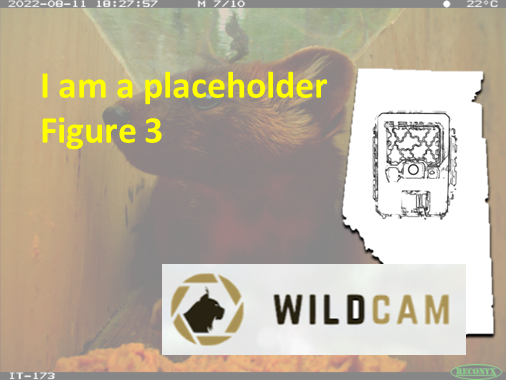

---
jupytext:
  formats: md:myst
  text_representation:
    extension: .md
    format_name: myst
kernelspec:
  display_name: Python 3
  language: python
  name: python3
editor_options:
  markdown:
    wrap: none
---
(i_fov_target)=
# {{ title_i_fov_target }}
::::::::{hint}
**{{ name_fov_target }}**: {{ def_fov_target }}
```{admonition} See also
:class: sidebar tip
{{ link_bdg_cam_placement }}
```
::::::::

```{include} pro_con_assump/fov_target_apc.md
```
::::::::{tab-set}

:::::::{tab-item} Overview
Remote cameras may be deployed to capture detections on specific man-made or natural features (i.e., “[FOV Target Feature](#fov_target)“) to maximize the detection of wildlife species or to measure the use of that feature. “[FOV Target Features](#fov_target) may include, for example, game trails, human trails, watering holes, mineral licks, rub trees, nest sites, etc.

[FOV Target Features](#fov_target) differ from [Camera Location Characteristics](#camera_location_characteristics) (see below) in that [FOV Target Features](#fov_target) are features the camera is aimed towards (e.g., a seismic line). In contrast, a [Camera Location Characteristics](#camera_location_characteristics) may include features outside of the camera’s [FOV](#field_of_view) (e.g., meadow habitat).

The decision of where exactly to place the camera will be influenced by the feature to target, the [Survey Objectives](#survey_objectives) and the number of [Target Species](#target_species), and, importantly, the sampling design, intended analysis and associated statistical [assumption](#mods_modelling_assumption)s.

Deploying cameras on or near [FOV Target Features](#fov_target) can provide meaningful information for some [objectives](#survey_objectives), but often introduces detection biases (Wearn & Glover-Kapfer, 2017). These biases make it difficult to extrapolate findings to areas without these features or to collect data on multiple [Target Species](#target_species)that vary in their use of these features (Wearn & Glover-Kapfer, 2017). To reduce potential biases, cameras should ideally be deployed using a [paired design](#sampledesign_paired), with cameras on- and off-[FOV Target Features](#fov_target) (e.g., on- and off-trails).

In general, cameras should be placed approximately **3–5 m from the** [FOV Target Feature](#fov_target) ([Figure 6](#TOC_surv_guidelines_fig_6); the “[FOV Target Feature Distance (m)](#fov_target_distance)“ [Figure 7](#TOC_surv_guidelines_fig_7)). If cameras are placed too close to the [FOV Target Feature](#fov_target), some species may not be detected since the camera may be too high to capture smaller species or the movement speed of certain species. In contrast, if cameras are placed too far from the [FOV Target Feature](#fov_target) (e.g., \> 5 m), animals detected at night may not be visible in the images because they are less likely to be illuminated by the infrared flash.

This recommendation can be relaxed if users plan to estimate the [detection distance](#detection_distance) (i.e., “the maximum distance that a sensor can detect a target” [Wearn and Glover-Kapfer, 2017]) and account for variability in [detection probability](#detection_probability).

:::{figure} ../0_figures/Survey-guidelines_WildCAM-FOV.png
:align: center
:scale: 70%
:name: TOC_surv_guidelines_fig_6
:::

**Figure 6.** Illustration of a remote camera showing (A) the [FOV Target Feature](#fov_target) (a trail), (B) the camera’s [detection zone](#detection_zone) (everything inside the red outline), and (C) the distance of the camera to the [FOV Target Feature](#fov_target). Note that the [detection zone](#detection_zone) will vary according to [Camera Make](#camera_make) and [Camera Model](#camera_model). Camera users will need to identify a suitable attachment point (e.g., tree, fence post/ stake) near the target area. The most suitable attachment point will depend on the [Camera Height](#camera_height), [angle](#camera_angle), and [direction](#camera_direction) since these choices will impact the [FOV](#field_of_view) (see [section 7.4](#TOC_surv_guidelines_camera_placement)). Figure from WildCAM Network (2019).
:::::::

:::::::{tab-item} In-depth
```{include} include/00_coming_soon.md
```
:::::::

:::::::{tab-item} Visual resources
::::::{grid} 3
:gutter: 3
:class-container: wrapper

:::::{grid-item-card} {{ rtxt_figure1_ref_id }}
<br><br>
figure1_caption
:::::

:::::{grid-item-card} {{ rtxt_figure2_ref_id }}
<br><br>
:::::

:::::{grid-item-card} {{ rtxt_figure3_ref_id }}
<br><br>
:::::

:::::{grid-item-card} {{ rtxt_figure4_ref_id }}
<br><br>
:::::

:::::{grid-item-card} {{ rtxt_figure5_ref_id }}
<br><br>
:::::

:::::{grid-item-card} {{ rtxt_figure6_ref_id }}
<br><br>
:::::

:::::{grid-item-card} {{ rtxt_figure7_ref_id }}
<br><br>
:::::

:::::{grid-item-card} {{ rtxt_figure8_ref_id }}
<br><br>
:::::

:::::{grid-item-card} {{ rtxt_figure9_ref_id }}
<br><br>
:::::

:::::{grid-item-card} {{ rtxt_figure10_ref_id }}
<br><br>
:::::

:::::{grid-item-card} {{ rtxt_figure11_ref_id }}
<br><br>
:::::

:::::{grid-item-card} {{ rtxt_figure12_ref_id }}
<br><br>
:::::

:::::{grid-item-card} {{ rtxt_vid1_ref_id }}
<div class="iframe-container-vid"><iframe class="iframe-responsive-vid" src="vid1_url"></iframe></div>

:::::

:::::{grid-item-card} {{ rtxt_vid2_ref_id }}
<div class="iframe-container-vid"><iframe class="iframe-responsive-vid" src="vid2_url"></iframe></div>

:::::

:::::{grid-item-card} {{ rtxt_vid3_ref_id }}
<div class="iframe-container-vid"><iframe class="iframe-responsive-vid" src="vid3_url"></iframe></div>

:::::

:::::{grid-item-card} {{ rtxt_vid4_ref_id }}
<div class="iframe-container-vid"><iframe class="iframe-responsive-vid" src="vid4_url"></iframe></div>

:::::

:::::{grid-item-card} {{ rtxt_vid5_ref_id }}
<div class="iframe-container-vid"><iframe class="iframe-responsive-vid" src="vid5_url"></iframe></div>

:::::

:::::{grid-item-card} {{ rtxt_vid6_ref_id }}
<div class="iframe-container-vid"><iframe class="iframe-responsive-vid" src="vid6_url"></iframe></div>

:::::

:::::{grid-item-card} {{ rtxt_vid7_ref_id }}
<div class="iframe-container-vid"><iframe class="iframe-responsive-vid" src="vid7_url"></iframe></div>

:::::

:::::{grid-item-card} {{ rtxt_vid8_ref_id }}
<div class="iframe-container-vid"><iframe class="iframe-responsive-vid" src="vid8_url"></iframe></div>

:::::

:::::{grid-item-card} {{ rtxt_vid9_ref_id }}
<div class="iframe-container-vid"><iframe class="iframe-responsive-vid" src="vid9_url"></iframe></div>

:::::

::::::

:::::::

:::::::{tab-item} Shiny apps/Widgets
Check back in the future!
:::::::

:::::::{tab-item} Shiny apps/Widgets
::::::{card} shiny_name
shiny_caption

<div class="iframe-container-shiny"><iframe class="iframe-responsive-shiny" src="shiny_url"></iframe></div>
::::::

:::::::

:::::::{tab-item} Shiny apps/Widgets
::::::{card}
:::::{dropdown} shiny_name
shiny_caption

<div class="iframe-container-shiny"><iframe class="iframe-responsive-shiny" src="shiny_url"></iframe></div>
:::::

:::::{dropdown} shiny_name2
shiny_caption2

<div class="iframe-container-shiny"><iframe class="iframe-responsive-shiny" src="shiny_url2"></iframe></div>
:::::

::::::

:::::::

:::::::{tab-item} Analytical tools & Resources
| Type | Name | Note | URL | Reference |
|:----------------|:-------------------------------|:----------------------------------------------------------------|:----------------------|:----------------------------------------|
|
:::::::

:::::::{tab-item} References
{{ rbib_clarke_et_al_2023 }}
:::::::

::::::::
